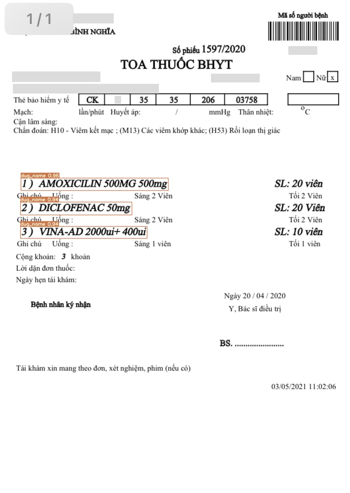

I. Huấn luyện mô hình detection thuốc

                1. cd yolov7T: Nhóm mới phát triển và implement vào yolov7: phương pháp sẽ cắt các thuốc ở ảnh
                và paste vào "Chỗ trống" của ảnh khác
                nhằm  tạo nhiều đơn thuốc và thuốc ngoài đơn khác nhau (ảnh minh họa ./result_detection)

                2. pip3 install -r requirements.txt

                3. Config dataset: file config pill.yaml:

                                - train: ./data\TRAIN\train

                                - val: ./data\TRAIN\val

                                - nc:108

                                - name: []

                4. Dowload pretrain model (yolov7x):

                                !wget https://github.com/WongKinYiu/yolov7/releases/download/v0.1/yolov7x_training.pt
                5. # train p5 models
                                python train.py --workers 0 --device 0 --batch-size 12 --data data/pill.yaml --img 640 640 --cfg cfg/training/yolov7x.yaml --weights 'yolov7x_training.pt'  --hyp data/hyp.scratch.p5.yaml

 

II. Huấn luyện mô hình detection đơn thuốc

                1. cd yolov7

                2. Config dataset: file config press.yaml:

                                - train: ./data\GEN_ALBUM

                                - val: ./data\GEN_ALBUM

                                - nc:1

                                - name: ['drug']

                3. Dowload pretrain model (yolov7):

                                !wget https://github.com/WongKinYiu/yolov7/releases/download/v0.1/yolov7.pt

                4. # train p5 models

                                python train.py --workers 0 --device 0 --batch-size 12 --data data/pill.yaml --img 640 640 --cfg cfg/training/yolov7.yaml --weights 'yolov7' --hyp data/hyp.scratch.p5.yaml
                5.Result from result_detection
                    
                    
III. Huấn luyện mô hình OCR

                1. cd vietocr

                2. python3 train_thang.py

-------------------------------------------------------------------------------------------------------------------------------------------------------------------

IV. Build project

/ai_detection_drug

  /detection: clean code for yolov7

  /recogniton: clean code for vietocr

  /weight

    + detection:
          +   final_detection_drug2.pt   model detection thuốc: RUN COMMAND: gdown "https://drive.google.com/file/d/1IhoSIjpX2PedpLGnHvoqbJHeeLDVeID6/view?usp=sharing"
          +   final_detect_pill.pt   model detection đơn thuốc : RUN COMMAND: gdown "https://drive.google.com/file/d/1dOvD_H_cM61KrwCnCFGlBz_vomI7-X5S/view?usp=sharing"
            

    + recognition:
          +   transformerocr.pth     model recogniton text

  / ocr.py: file xử lý chính của project

  / pill_pres_map.json : file map ảnh thuốc với ảnh đơn thuốc

  / id_drug.txt: file tất cả tên thuốc và id tương ứng từ tập train

Full process of project:

                1. Detection đơn thuốc

                2. Ocr các thuốc có trong đơn

                3. So sánh với file id_drug.txt và lưu vào mảng các id thuốc có trong đơn

                4. Đọc file pill_pres_map.json để tìm các ảnh thuốc tương ứng với đơn thuốc

                5. Detection ảnh thuốc lưu id thuốc của từng ảnh vào mảng

                6. So sánh với mảng thuốc trong đơn không có thì replace thành id 107 (thuốc ngoài đơn)

                7. Write file results csv
Build dockerfile 

Dockerfile in folder yolov7T

docker build -t i-training_detection_drug2:version1 -f Dockerfile .

docker run -i -t i-training_detection_drug2:version1

Dear ban tổ chức do nhóm đang để data trên window nên đường link mount tới không được, nên nhóm đã đóng gói tất cả data
vào file docker image (tổng 16.5 GB cho file docker image bao gồm 3 bộ data detection thuốc, đơn thuốc, ocr)
Mong BTC chấp nhận ạ, cảm ơn BTC.

Bbox Mix: light create new for detetion drug

